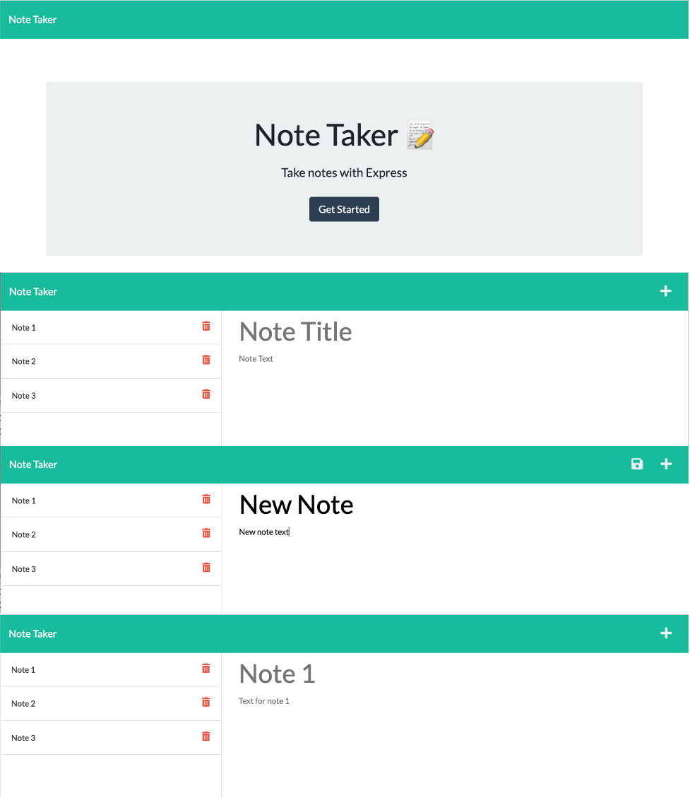

# Note Taker

## Description
The Note Taker application was created to allow users to take notes and save notes in order to keep their days and schedules organized. This application provides an easy to use interface that displays all saved notes as well as the current active note. This application also allows users to delete unwanted or completed notes they have created. 

## Table of Contents
  * [Built With](#built-with)
  * [Code Access](#code-access)
  * [Preview](#preview)
  * [Installation](#installation)
  * [Usage](#usage)
  * [License](#license)
  * [Note Taker Link](#note-taker-link)
  * [Questions](#questions)
  * [Credits](#credits)

## Built With

The Note Taker application was built with:
- JavaScript
- Node.js
- File System
- npm
- Inquirer
- HTML
- CSS
- Express.js

## Code Access

If you would like to access the code for this application, please visit [GitHub](https://github.com/sm3131/note-taker)

## Preview
Example Note Taker application functionality:

## Installation
If you would like to locally serve the Note Taker application instead of viewing it through the Heroku link provided below follow these instructions to install and get the application running:
1. Clone the application's code from this [GitHub](https://github.com/sm3131/note-taker) repository onto your local machine into a new directory (e.g. note-taker).
2. Open the command line and navigate to the directory you cloned this repository into, then open the content in a code text editor. You should now see the main files and folders for this project (server.js, /Routes, /public, /db).
3. Next check to see if you have node.js installed on your machine by running the command *node -v* in your command line.
4. If you have node.js make sure your version is up to date by going to this website (https://nodejs.org/en/).
5. If you do not have node.js installed follow the installation steps on this website (https://nodejs.org/en/).
6. Once you have node.js installed, make sure you are still in the note-taker directory in the command line, and then run the following command *npm install* to install the required packages and dependencies to run the application.
7. After you have node.js and the required npm dependencies installed, you are ready to run the application via node.js using the command line.
8. Start by entering the command npm start to get the express server started (You should receive a message in your command line that states "API server now on port 3001!")
9. Once your server is running open up a browser and search the following URL: "http://localhost:3001/"
10. This should bring you to the application's landing page, and then you can follow the usage instruction below to navigate around the app

## Usage
To use the Note Taker application follow the steps below:
1. Upon opening the note taker application in your browser, you will be confronted with the applications landing page, which has the apps name, a brief description, and a "Get Started" button.
2. Clicking on the "Get Started" button will take you to the note taking page, where you will see a header bar with a "+" sign on the far right, and then below this bar there are two main columns the one on the left will store all of your saved notes and the one on the right will be where you either display saved notes or write a new note.
3. In order to write a new note you can click on the "+" sign and then click on the "Note Title" to start typing your note title then either hit tab or click on the "Note Text" section to type the content of you note 
4. Once you are finished typing your new note you should now see a save button to the left of the "+" sign button, and clicking this will save your new note into the application's database as well as into the left hand column with your other saved notes
5. If you would like to display your saved notes into the main right hand column of the page, then simply click on the saved note's text and it will populate into the area where you write new notes. 
6. If you would like to delete a saved note, simply click on the trash can icon found to the right of your saved notes, and this will permanently delete your note from the database, and from your list of saved notes in the browser.

## License

MIT License

Copyright (c) 2022 Sammi Moore

Permission is hereby granted, free of charge, to any person obtaining a copy
of this software and associated documentation files (the "Software"), to deal
in the Software without restriction, including without limitation the rights
to use, copy, modify, merge, publish, distribute, sublicense, and/or sell
copies of the Software, and to permit persons to whom the Software is
furnished to do so, subject to the following conditions:

The above copyright notice and this permission notice shall be included in all
copies or substantial portions of the Software.

THE SOFTWARE IS PROVIDED "AS IS", WITHOUT WARRANTY OF ANY KIND, EXPRESS OR
IMPLIED, INCLUDING BUT NOT LIMITED TO THE WARRANTIES OF MERCHANTABILITY,
FITNESS FOR A PARTICULAR PURPOSE AND NONINFRINGEMENT. IN NO EVENT SHALL THE
AUTHORS OR COPYRIGHT HOLDERS BE LIABLE FOR ANY CLAIM, DAMAGES OR OTHER
LIABILITY, WHETHER IN AN ACTION OF CONTRACT, TORT OR OTHERWISE, ARISING FROM,
OUT OF OR IN CONNECTION WITH THE SOFTWARE OR THE USE OR OTHER DEALINGS IN THE
SOFTWARE.

## Note Taker Link

Click on the heroku link below to use the Note Taker application:
https://note-taker-3131.herokuapp.com/

## Questions

If you would like to access this project's repository as well as other projects in my GitHub, click this [GitHub](https://github.com/sm3131) link. 

For all other questions or inquires please feel free to contact me via email at [sm2683@nau.edu](mailto:sm2683@nau.edu)

## Credits

The front end code for this application was provided by [Xandromus](https://github.com/coding-boot-camp/miniature-eureka). This code contained all of the html, css, and js files required for the user interface for the application, and the initial database file for the notes.
All of the back end code was written by myself, Sammi Moore. This included writing code for the Express.js server, and creating all of the api and html routes in order to properly serve the application to users. 

The resources that I used for this project are as follows:

- The inquirer package from npm in this node.js application in order to generate user prompt questions (https://www.npmjs.com/package/inquirer)
- The Express package from npm to create a server in node.js (https://www.npmjs.com/package/express)
- https://opensource.org/licenses/ (To borrow the license section text describing the terms of each of the licenses included in the readme generator)
- https://shields.io/ (To generate the link to create the license badge)

For the license badges and license section of the readme, I used the following resources:
- https://choosealicense.com/ (To help with picking which licenses to include)
- https://shields.io/ (To generate the link to create the license badge)
- https://wisehackermonkey.github.io/badge-demo/ (To help with coloring the license badges and grabbing the license links)
- https://opensource.org/licenses/ (To borrow the license section text describing the terms of each of the licenses included in the readme generator)

- I also used some of the documentation and material from the lessons in module 11 in order to remember how to properly create an express server in node.js